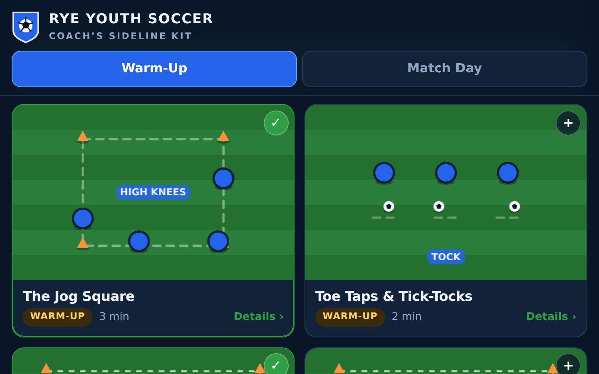

# Rye Youth Soccer — coach's sideline kit

A single web page for a parent coach on a Saturday morning. No app store, no
login, no server: open it in a browser, add it to your home screen, and it
works on the touchline whether or not there is a signal.

**→ https://sammchugh-gif.github.io/Rye-Youth-Soccer/**

It does two things, because the hour at the field is two things.

## Warm-up — the fifteen minutes before the horn

Twelve drills pitched at seven-to-nine year olds. Each one is drawn as a
looping diagram, so you can see the shape of it before the cones go out, and
comes with what to set up, how it runs, the one sentence worth saying while
it runs, and what to change if it is going well or falling apart.

Tap drills until the meter reads fifteen minutes, or take one of four
ready-made fifteens — *First Saturday*, *Ball mastery*, *Passing day*, *Just
let them play*. Then hit **Run it** and the phone counts each drill down,
warns you at ten seconds and chimes on the change.

## Match day — the clock and the substitutions

Type in who turned up. Mark anyone who would rather not go in goal. Kick off.

The page then runs the game — two eighteen-minute halves with a four-minute
half-time by default — and at every shift tells you, in large type:

- the clock, and how long until the next change
- who is on the pitch, with the keeper in gold
- **CHANGE NOW**, naming who comes off and who goes on, with a beep and a buzz
- who is resting, and which of them is up next

Nothing about the plan is fixed. Sub early, take a player off with a bumped
knee, or add a late arrival, and the shifts that are left are worked out
again from the clock, carrying over the minutes already served. A match in
progress survives the phone locking or the page reloading.

### How it shares out the minutes

At every shift, the four children with the fewest minutes so far go on, and
of those four, whoever has spent least time in goal goes in goal. Choosing by
"fewest so far" rather than by a fixed rotation is what lets the plan survive
the morning — after any interruption the remaining shifts quietly even
everything back up.

Measured over a full game, 2 × 18 with four shifts a half:

| Players | Minutes each | Minutes in goal |
|--------:|:-------------|:----------------|
| 4 | 36 all | 9 all |
| 5 | 27–32 | 5–9 |
| 6 | 23–27 | 5–9 |
| 7 | 18–23 | 5–9 |
| 8 | 18 all | 4.5 all |

Nobody is ever more than one shift away from anybody else, and everybody gets
a turn in goal.

How even it comes out depends on the number of shifts *and* how many turned
up — six children share four shirts perfectly in threes, five or seven do
not. So the setup screen labels each shift count with what it costs today
(*dead even*, *±4.5m*, *no goal for 2*) rather than choosing for you.

## Running it

There is nothing to build. `index.html` is the whole application; `fresh.js`
stops a home-screen copy serving you yesterday's version. To work on it,
open `index.html` in a browser.

It is published by GitHub Pages straight from `main` — Settings → Pages →
*Deploy from a branch*, `main`, `/ (root)` — so pushing to `main` is the
deploy. `.nojekyll` keeps Pages from running the files through Jekyll.

Squad, settings and any match in progress are kept in the browser's
`localStorage` on your own device. Nothing is sent anywhere.

## Making it yours

- **The crest and the colours** are a placeholder in `index.html`: an inline
  SVG shield in `<header>`, and the palette in the `:root` block at the top
  of the stylesheet. `--rye` is the accent.
- **The drills** are the `DRILLS` array. Each entry is its text plus a `draw`
  function that paints one looping cycle onto a 100 × 62 pitch; the helpers
  above it (`cone`, `player`, `ball`, `goal`, `path`, `tag`) do the drawing.
- **The match format** — half length, half-time, shifts per half, and three,
  four or five a side — is all on the Match Day screen, so a different age
  group needs no code.
